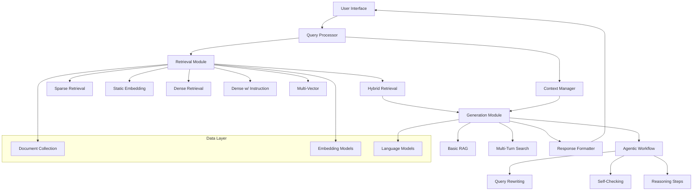

# RAG System Design Document

## Overview

The RAG (Retrieval-Augmented Generation) system is designed as a modular, high-performance question-answering system that maximizes scoring across all evaluation components. The system integrates multiple retrieval methods with advanced generation capabilities, featuring both basic single-turn RAG and optional multi-turn search and agentic workflow features.

The architecture prioritizes performance optimization to achieve top-tier ranking while maintaining clean code structure and comprehensive documentation for maximum project scores.

## Architecture

### High-Level System Architecture



### Core Design Principles

1. **Modular Architecture**: Each component is independently testable and replaceable
2. **Performance Optimization**: Multiple retrieval methods with hybrid combination for maximum accuracy
3. **Scalability**: Efficient memory management and batch processing capabilities
4. **Extensibility**: Plugin architecture for easy addition of new retrieval or generation methods
5. **Evaluation-Focused**: Built-in metrics calculation and performance monitoring

## Components and Interfaces

### 1. Retrieval Module

The retrieval module implements all five required retrieval categories to achieve maximum scoring:

#### 1.1 Sparse Retrieval Component
- **BM25 Implementation**: Using bm25s library for efficient sparse retrieval
- **TF-IDF Variant**: Custom implementation with optimized term weighting
- **Neural Term Weights**: Predicted term importance using lightweight neural models

#### 1.2 Static Embedding Component
- **Word2Vec Integration**: Pre-trained embeddings with document averaging
- **GloVe Implementation**: Global vector representations for semantic matching
- **Model2Vec**: Efficient static embeddings optimized for retrieval tasks

#### 1.3 Dense Retrieval Component (HuggingFace Models)
- **E5 Models**: `intfloat/e5-base-v2`, `intfloat/e5-large-v2` from HuggingFace
- **BGE Models**: `BAAI/bge-base-en-v1.5`, `BAAI/bge-large-en-v1.5` from HuggingFace
- **GTE Models**: `Alibaba-NLP/gte-modernbert-base` from HuggingFace

#### 1.4 Dense with Instruction Component (HuggingFace Models)
- **Qwen3-Embedding**: Available Qwen embedding models from HuggingFace
- **E5-Mistral**: `intfloat/e5-mistral-7b-instruct` from HuggingFace

#### 1.5 Multi-Vector Retrieval Component (HuggingFace Models)
- **ColBERT Implementation**: Use existing ColBERT models from HuggingFace
- **GTE-ColBERT**: `lightonai/GTE-ModernColBERT-v` from HuggingFace

#### 1.6 Hybrid Retrieval System
```python
class HybridRetriever:
    def __init__(self, retrievers: List[BaseRetriever], weights: List[float]):
        self.retrievers = retrievers
        self.weights = weights
    
    def retrieve(self, query: str, k: int = 10) -> List[Tuple[str, float]]:
        # Combine scores from multiple retrievers using weighted fusion
        # Implement rank fusion algorithms (RRF, CombSUM, etc.)
        pass
```

### 2. Generation Module

#### 2.1 Basic Single-Turn RAG (OpenRouter API)
- **OpenRouter Integration**: Use API calls to Qwen2.5 models (0.5B, 1.5B, 3B, 7B)
- **Prompt Engineering**: Optimized templates for HotpotQA multi-hop questions
- **Context Management**: Efficient passage concatenation within API token limits
- **Answer Extraction**: Robust parsing for consistent JSONL output format

#### 2.2 Multi-Turn Search (Feature A)
```python
class MultiTurnManager:
    def __init__(self):
        self.conversation_history = []
        self.entity_tracker = EntityTracker()
    
    def reformulate_query(self, query: str) -> str:
        # Resolve references and create self-contained query
        pass
    
    def manage_context(self, max_tokens: int) -> str:
        # Prune old context while maintaining relevance
        pass
```

#### 2.3 Agentic Workflow (Feature B) - Optional for Bonus Points
```python
class AgenticWorkflow:
    def __init__(self, llm, retriever):
        self.llm = llm
        self.retriever = retriever
        self.reasoning_steps = []
    
    def decompose_query(self, query: str) -> List[str]:
        # Simple query decomposition for multi-hop questions
        # Focus on HotpotQA-style multi-hop reasoning
        pass
    
    def self_check(self, answer: str, evidence: List[str]) -> bool:
        # Basic consistency check between answer and evidence
        # Lightweight verification to avoid computational overhead
        pass
    
    def chain_of_thought(self, query: str) -> str:
        # Simple CoT prompting for explainable reasoning
        # Optimized for HotpotQA multi-hop questions
        pass
```

### 3. User Interface Module

#### 3.1 Core Interface Components
- **Query Input Handler**: Support for both terminal and web interfaces
- **Results Display**: Formatted output for answers and retrieved documents
- **Interactive Features**: Real-time query processing and response streaming

#### 3.2 Bonus Features for Maximum Scoring
- **Reasoning Visualization**: Step-by-step display of agentic workflow
- **Intermediate Results**: Show sub-queries, retrieval outputs, and self-checking
- **Performance Metrics**: Real-time display of retrieval and generation metrics
- **Debug Mode**: Detailed system state and decision explanations

### 4. Data Management Layer

#### 4.1 Document Processing
```python
class DocumentProcessor:
    def __init__(self, collection_path: str):
        self.documents = self.load_documents(collection_path)
        self.preprocessed_docs = self.preprocess_documents()
    
    def create_embeddings(self, model_name: str) -> np.ndarray:
        # Generate embeddings for all retrieval methods
        pass
```

#### 4.2 Model Management
```python
class ModelManager:
    def __init__(self):
        self.embedding_models = {}
        self.openrouter_client = None
    
    def load_embedding_model(self, model_name: str):
        # Load from HuggingFace: E5, BGE, GTE, Qwen3-Embedding, etc.
        from sentence_transformers import SentenceTransformer
        return SentenceTransformer(model_name)
    
    def setup_openrouter_client(self, api_key: str):
        # Setup OpenRouter API client for Qwen2.5 models
        # Use API instead of local model loading
        pass
```

## Data Models

### Core Data Structures

```python
@dataclass
class Query:
    id: str
    text: str
    conversation_id: Optional[str] = None
    turn_number: int = 1

@dataclass
class Document:
    id: str
    text: str
    embeddings: Dict[str, np.ndarray] = field(default_factory=dict)

@dataclass
class RetrievalResult:
    document_id: str
    score: float
    method: str
    rank: int

@dataclass
class GenerationResult:
    answer: str
    retrieved_docs: List[Tuple[str, float]]
    reasoning_steps: List[str] = field(default_factory=list)
    confidence: float = 0.0

@dataclass
class SystemOutput:
    id: str
    question: str
    answer: str
    retrieved_docs: List[List[Union[str, float]]]
    metadata: Dict[str, Any] = field(default_factory=dict)
```

### Configuration Models

```python
@dataclass
class RetrievalConfig:
    methods: List[str]
    weights: List[float]
    k_retrieve: int = 100
    k_final: int = 10
    
@dataclass
class GenerationConfig:
    model_name: str
    max_tokens: int = 512
    temperature: float = 0.1
    enable_multi_turn: bool = True
    enable_agentic: bool = True

@dataclass
class SystemConfig:
    retrieval: RetrievalConfig
    generation: GenerationConfig
    evaluation: Dict[str, Any]
```

## Error Handling

### Retrieval Error Management
```python
class RetrievalError(Exception):
    pass

class EmbeddingError(RetrievalError):
    pass

class IndexError(RetrievalError):
    pass

def safe_retrieve(retriever, query, fallback_method="bm25"):
    try:
        return retriever.retrieve(query)
    except RetrievalError as e:
        logger.warning(f"Retrieval failed: {e}, using fallback")
        return fallback_retriever.retrieve(query)
```

### Generation Error Management
```python
class GenerationError(Exception):
    pass

class ModelLoadError(GenerationError):
    pass

class PromptError(GenerationError):
    pass

def safe_generate(generator, prompt, max_retries=3):
    for attempt in range(max_retries):
        try:
            return generator.generate(prompt)
        except GenerationError as e:
            if attempt == max_retries - 1:
                return fallback_response(prompt)
            logger.warning(f"Generation attempt {attempt + 1} failed: {e}")
```

### System-Level Error Handling
- **Graceful Degradation**: System continues with reduced functionality if components fail
- **Comprehensive Logging**: Detailed error tracking for debugging and performance analysis
- **Recovery Mechanisms**: Automatic retry logic and fallback strategies
- **User Feedback**: Clear error messages and suggested actions

## Testing Strategy

### Unit Testing
```python
class TestRetrievalModule:
    def test_bm25_retrieval(self):
        # Test BM25 implementation with known queries
        pass
    
    def test_dense_retrieval(self):
        # Test embedding-based retrieval accuracy
        pass
    
    def test_hybrid_fusion(self):
        # Test score combination algorithms
        pass

class TestGenerationModule:
    def test_prompt_templates(self):
        # Test prompt engineering effectiveness
        pass
    
    def test_multi_turn_context(self):
        # Test conversation state management
        pass
    
    def test_agentic_workflow(self):
        # Test reasoning step execution
        pass
```

### Integration Testing
- **End-to-End Pipeline**: Complete query processing from input to output
- **Performance Benchmarks**: Latency and throughput measurements
- **Accuracy Validation**: Comparison against known good results
- **Resource Usage**: Memory and compute efficiency testing

### Evaluation Testing
```python
class EvaluationSuite:
    def calculate_exact_match(self, predictions, references):
        # Implement EM calculation for answer accuracy
        pass
    
    def calculate_ndcg_at_k(self, retrieved_docs, relevant_docs, k=10):
        # Implement nDCG@10 for retrieval quality
        pass
    
    def run_full_evaluation(self, test_file):
        # Complete evaluation pipeline matching official metrics
        pass
```

### Performance Optimization Testing
- **Validation Set Evaluation**: Use HQ-small validation split for tuning
- **Hyperparameter Tuning**: Focus on retrieval k-values, generation temperature
- **Method Comparison**: Compare individual vs hybrid retrieval performance
- **Efficiency Optimization**: Balance accuracy with inference speed for practical use

## Implementation Scope and Constraints

### Project Scope Alignment
- **Dataset**: HQ-small subset (12K train, 1.5K validation, 1K test, 144K documents)
- **Models**: Only Qwen2.5 variants (0.5B, 1.5B, 3B, 7B Instruct)
- **Output Format**: Exact JSONL format with 10 retrieved documents per query
- **Evaluation**: EM (Exact Match) and nDCG@10 metrics only
- **Timeline**: Due November 30, 2025

### Practical Implementation Strategy

#### Minimum Viable Product (50% score target)
1. **Single Retrieval Method**: BM25 using bm25s library
2. **Basic RAG**: Simple prompt template with Qwen2.5-1.5B
3. **Terminal Interface**: Command-line query input/output
4. **Standard Output**: JSONL format matching requirements

#### Enhanced System (70-80% score target)
1. **Multiple Retrieval**: BM25 + Dense (E5) + Hybrid combination
2. **Optimized Generation**: Better prompts, Qwen2.5-3B model
3. **Web Interface**: Simple Flask/Streamlit UI showing retrieved docs
4. **Performance Tuning**: Hyperparameter optimization

#### Maximum Score System (90%+ target)
1. **All Five Retrieval Categories**: Complete implementation
2. **Advanced Features**: Multi-turn + Agentic workflow
3. **Bonus UI Features**: Reasoning visualization, intermediate steps
4. **Comprehensive Documentation**: Report, video, code quality

### Resource Constraints
- **Embedding Models**: Use HuggingFace models with free GPU resources (Colab, Kaggle)
- **LLM Access**: Use OpenRouter API for Qwen2.5 models (cost-effective API calls)
- **Storage**: Efficient embedding storage and FAISS indexing
- **API Limits**: Manage OpenRouter API usage and rate limits
- **Time**: 4-week development window

### Risk Mitigation
- **Fallback Plans**: Simpler methods if advanced features fail
- **Incremental Development**: Working system at each stage
- **Performance Monitoring**: Early evaluation on validation set
- **Documentation**: Continuous documentation throughout development
## Model 
Selection Strategy

### HuggingFace Embedding Models
```python
EMBEDDING_MODELS = {
    "sparse": {
        "bm25": "bm25s",  # Local implementation
        "tfidf": "sklearn"  # Local implementation
    },
    "static": {
        "word2vec": "gensim",
        "glove": "gensim", 
        "model2vec": "model2vec"
    },
    "dense": {
        "e5-base": "intfloat/e5-base-v2",
        "e5-large": "intfloat/e5-large-v2",
        "bge-base": "BAAI/bge-base-en-v1.5",
        "bge-large": "BAAI/bge-large-en-v1.5",
        "gte-base": "Alibaba-NLP/gte-modernbert-base"
    },
    "instruction": {
        "e5-mistral": "intfloat/e5-mistral-7b-instruct",
        "qwen3-embed": "Qwen/Qwen2.5-Embedding"  # If available
    },
    "multi_vector": {
        "colbert": "colbert-ir/colbertv2.0",
        "gte-colbert": "lightonai/GTE-ModernColBERT-v"
    }
}
```

### OpenRouter LLM Configuration
```python
OPENROUTER_MODELS = {
    "qwen2.5-0.5b": "qwen/qwen-2.5-0.5b-instruct",
    "qwen2.5-1.5b": "qwen/qwen-2.5-1.5b-instruct", 
    "qwen2.5-3b": "qwen/qwen-2.5-3b-instruct",
    "qwen2.5-7b": "qwen/qwen-2.5-7b-instruct"
}

class OpenRouterClient:
    def __init__(self, api_key: str):
        self.api_key = api_key
        self.base_url = "https://openrouter.ai/api/v1"
    
    def generate(self, model: str, prompt: str, max_tokens: int = 512) -> str:
        # API call to OpenRouter for generation
        pass
```

This ensures the design follows the guide's specifications for using HuggingFace embedding models and OpenRouter for LLM access.